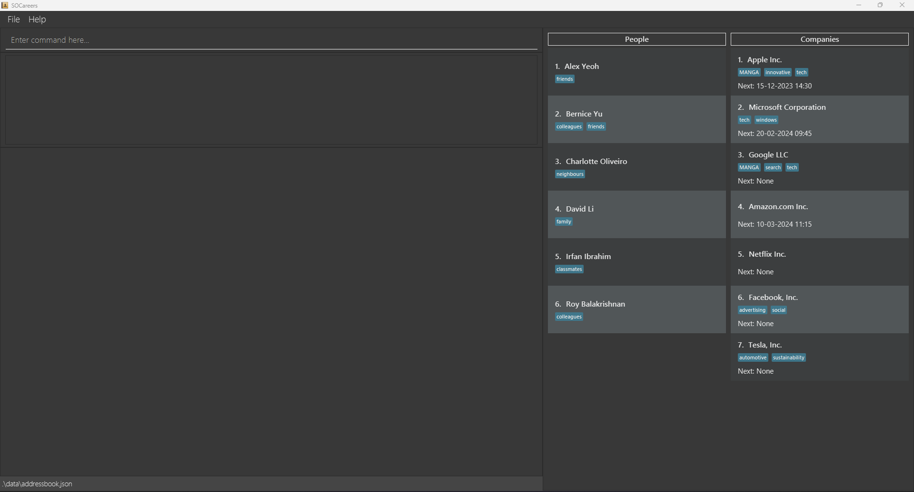
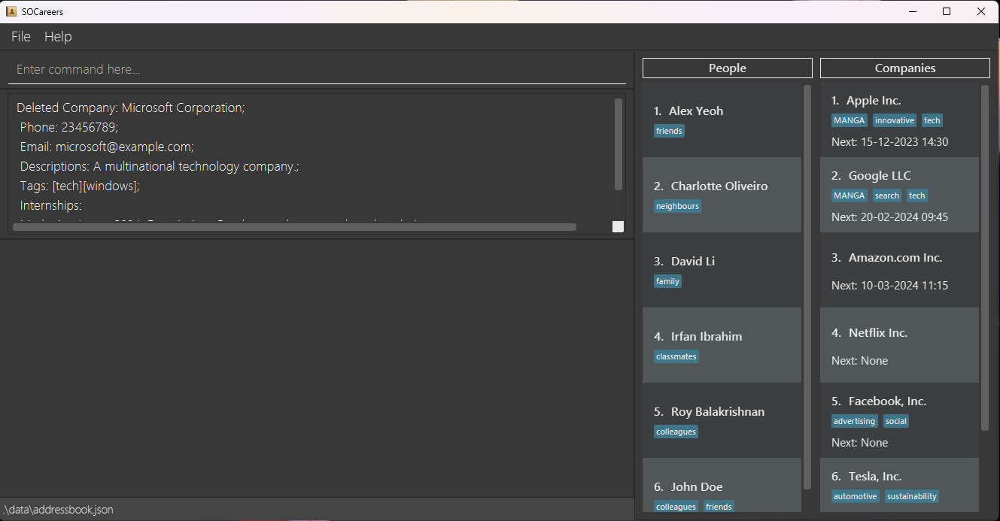

# User Guide of SOCareers
SOCareers is an **all-in-one app that helps CS majors to keep track of jobs/internship-related content**. The app allows students to keep track of company application timelines, their networks of people, and interview timelines.

- [Quick Start](#quick-start)
- [Features](#features)
  - [Adding a person to contacts](#adding-a-person-to-contacts-add-p)
  - [Adding a company to contacts](#adding-a-company-to-contacts-add-c)
  - [Deleting a person from contacts](#deleting-a-person-from-contacts-delete-p)
  - [Deleting a company from contacts](#deleting-a-company-from-contacts-delete-c)
  - [Viewing a list of all persons](#viewing-a-list-of-all-persons-list-p)
  - [Viewing a list of all companies](#viewing-a-list-of-all-companies-list-c)
  - [Viewing a person's contact](#viewing-a-persons-contact-view-p)
  - [Viewing a company's contact](#viewing-a-companys-contact-view-c)
  - [Finding a person by name or tag](#finding-a-person-by-name-or-tag-find-p)
  - [Finding a company by name or tag](#finding-a-company-by-name-or-tag-find-c)
- [FAQ](#faq)
- [Known Issues](#known-issues)
- [Command Summary](#command-summary)

--------------------------------------------------------------------------------------------------------------------

## Quick start

1. Ensure you have Java `11` or above installed in your Computer.

1. Download the latest `SOCareers.jar` from [here]([https://github.com/AY2324S1-CS2103T-T10-4/tp/releases).

1. Move `SOCareers.jar` to the folder you want to use as the _home folder_ for SOCareers.

   * The _home folder_ is the location where SOCareers' internal data will be stored.

   * Bear in mind that the _home folder_'s contents may be changed by SOCareers.

   * It is recommended to create a new empty folder to act as a _home folder_.

1. Open a command terminal, navigate into the folder you put the jar file in using `cd` , and run the `java -jar SOCareers.jar` command to start the application. 
   A GUI similar to the below should appear in a few seconds. Note how the app contains some sample data. 
   

   (Placeholder here to remind us to have another UI image where each section of the UI is boxed up and described/explained to the user in detail. -- For CS2101)

1. Type the command in the command box and press Enter to run it.
   Here are some example commands you can run:

   * `list` : Lists all contacts.

   * `add p n/John Doe p/98765432 e/johnd@example.com a/John street, block 123, #01-01` : Adds a person contact named `John Doe` to SOCareers.

   * `delete c 3` : Deletes the 3rd company contact shown in the current list.

   * `exit` : Exits the app.

1. Refer to the [Features](#features) below for details of each command.
--------------------------------------------------------------------------------------------------------------------

## Features

**:information_source: Notes about the command format:** 

* Words in `UPPER_CASE` are the parameters to be supplied by the user. 
  e.g. in `add p n/NAME p/PHONE_NUMBER e/EMAIL a/ADDRESS`, all the parameters are compulsory to be supplied.

* Items in square brackets are optional. 
  e.g `n/NAME [t/TAG]` can be used as `n/John Doe t/friend` or as `n/John Doe`.

* Parameters can be in any order. 
  e.g. if the command specifies `n/NAME p/PHONE_NUMBER e/EMAIL`, `e/EMAIL p/PHONE_NUMBER n/NAME` is also acceptable.

* If you are using a PDF version of this document, be careful when copying and pasting commands that span multiple lines as space characters surrounding line-breaks may be omitted when copied over to the application.

### Adding a person to contacts: `add p`

Adds a person of your interest.

Format: `add p n/NAME p/PHONE_NUMBER e/EMAIL a/ADDRESS [t/TAG]`
* Person's `NAME`, `PHONE_NUMBER`, `EMAIL`, and `ADDRESS` are compulsory fields.
* `TAG` is optional and can be used multiple times.

Examples:
* `add p n/John Doe p/98765432 e/johnd@example.com a/311, Clementi Ave 2, #02-25 t/friend t/colleague`:
  

### Adding a company to contacts: `add c`

Adds a company of your interest.

Format: `add c n/COMPANY_NAME p/PHONE_NUMBER e/EMAIL d/DESCRIPTION [t/TAG]`
* Company's `COMPANY_NAME`, `PHONE_NUMBER`, `EMAIL`, and `DESCRIPTION` are compulsory fields.
* `TAG` is optional and can be used multiple times.

Examples:
* `add c n/Apple p/98765432 e/applehr@example.com d/Top tech company t/tech t/interested`:
  

### Deleting a person from contacts: `delete p`

Deletes the specified person from the contact book.

Format: `delete p INDEX`
* Deletes the person with the specified `INDEX` from the contact list.
* The index refers to the index number shown in the displayed persons list.
* The index must be a positive integer and not exceed the total number of persons.

### Deleting a company from contacts: `delete c`

Deletes the specified company from the contact book.

Format: `delete c INDEX`
* Deletes the company with the specified `INDEX` from the contact list.
* The index refers to the index number shown in the displayed company list.
* The index must be a positive integer and not exceed the total number of companies.

Examples:
* `list c` followed by `delete c 2` deletes the second company in the list:
  

### Viewing a list of all persons: `list p`

Shows a list of all persons in the contact list.

Format: `list p`

### Viewing a list of all companies: `list c`

Shows a list of all companies in the contact list.

Format: `list c`

Examples:
* `list c` shows:
  

### Viewing a person's contact `view p`

View a single person's contact.

Format: `view p INDEX`
* Views the contact with the specified `INDEX` from the contact list.
* The index refers to the index number shown in the person contact list.
* The index must be a positive integer and not exceed the total number of contacts.

Examples:
* `list p` followed by `view p 1` views the first contact in the contact list:
  

### Viewing a company's contact: `view c`

View a single company's contact.

Format: `view c INDEX`
* Views the contact with the specified `INDEX` from the contact list.
* The index refers to the index number shown in the company contact list.
* The index must be a positive integer and not exceed the total number of contacts.

Examples:
* `list c` followed by `view c 1` views the first contact in the companies list:
  

### Finding a person by name or tag: 'find p'

Find a person by name or tag.

Format: `find p [n/KEYWORD] [t/TAG]`

Search Criteria:
* The search is case-insensitive. e.g. `john` will match `John`.
* Only the name and tags are searched.
* Persons matching at least one of the keywords and tags will be returned (i.e. OR search).

Parameters:
* `KEYWORD` is optional and can be used multiple times.
* `TAG` is optional and can be used multiple times.
* At least one of the parameters must be supplied.

Restrictions:
* `KEYWORD` and `TAG` must be alphanumeric.
* They cannot contain special characters nor spaces.
* Partial words are not supported. e.g. `Jo` will not match `John`.

Examples:
* `find p n/John Doe t/friend` returns `John Doe`:
  

### Finding a company by name or tag: 'find c'

Find a company by name or tag.

Format: `find c [n/KEYWORD] [t/TAG]`

Search Criteria:
* The search is case-insensitive. e.g. `apple` will match `Apple`.
* Only the name and tags are searched.
* Companies matching at least one of the keywords and tags will be returned (i.e. OR search).

Parameters:
* `KEYWORD` is optional and can be used multiple times.
* `TAG` is optional and can be used multiple times.
* At least one of the parameters must be supplied.

Restrictions:
* `KEYWORD` and `TAG` must be alphanumeric.
* They cannot contain special characters nor spaces.
* Partial words are not supported. e.g. `App` will not match `Apple`.

Examples:
* `find c n/Apple t/tech` returns `Apple`:
  
### [stuff] `[coming in v1.2]`

_Details coming soon ..._
--------------------------------------------------------------------------------------------------------------------

## FAQ

**Q**: How do I transfer my data to another Computer? 
**A**: Install the app in the other computer and overwrite the empty data file it creates with the file that contains the data of your previous SOConnect home folder.

--------------------------------------------------------------------------------------------------------------------

## Known issues

1. There are no issues in Ba Sing Se.

--------------------------------------------------------------------------------------------------------------------

## Command summary

| Action   | Format                 | Examples                                                                                                                                                                                               |
|----------|------------------------|--------------------------------------------------------------------------------------------------------------------------------------------------------------------------------------------------------|
| Add      | `add c`, `add p`       | e.g., `add p n/John Doe p/98765432 e/johnd@example.com a/311, Clementi Ave 2, #02-25 t/friends t/owesMoney`; `add c n/Apple p/98765432 e/johnd@example.com d/Top tech company t/tech t/interested` |
| Delete   | `delete c INDEX`, `delete p INDEX` | e.g., `delete p 3`                                                                                                                                                                                     |
| List     | `list c`, `list p`     |                                                                                                                                                                                                        |
| View     | `view c INDEX`, `view p INDEX`   | e.g., `view c 1`                                                                                                                                                                                       |
| Find     | `find c`, `find p`     | e.g., `find p n/John Doe t/friend`                                                                                                                                                                     |
