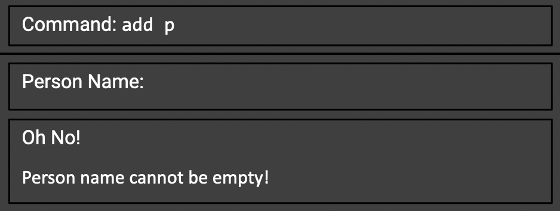
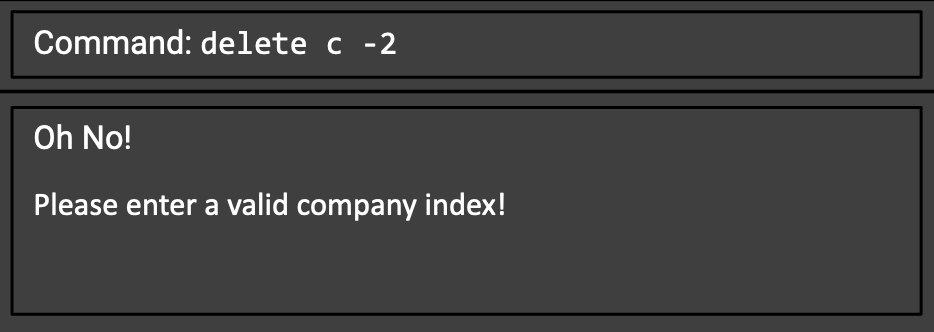
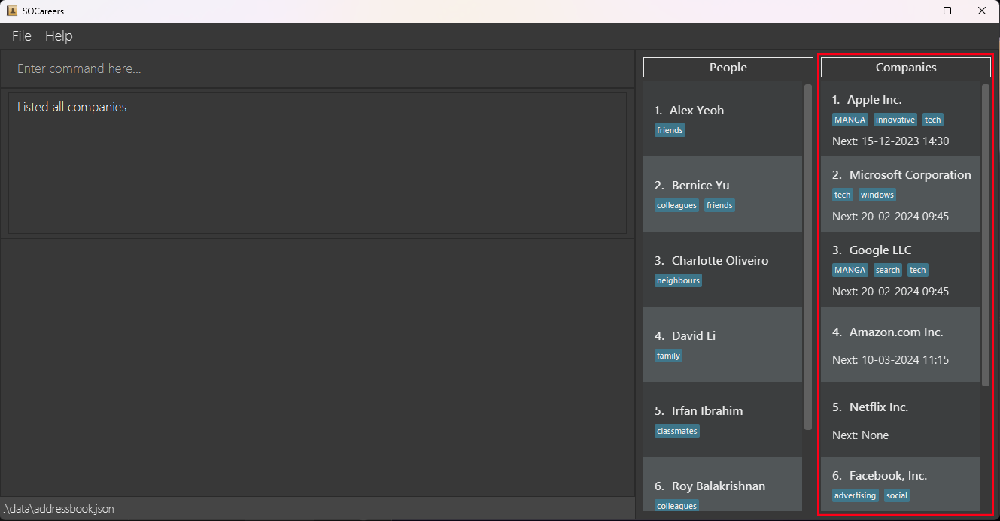

# User Guide of SOCareers
SOCareers is an **all-in-one app that helps CS majors to keep track of jobs/internship-related content**. The app allows students to keep track of company application timelines, their networks of people, and interview timelines.

- [Quick Start](#quick-start)
- [Features](#features)
  - [Adding a person to contacts](#adding-a-person-to-contacts-add-p)
  - [Adding a company to contacts](#adding-a-company-to-contacts-add-c)
  - [Deleting a person from contacts](#deleting-a-person-from-contacts-delete-p)
  - [Deleting a company from contacts](#deleting-a-company-from-contacts-delete-c)
  - [Viewing a list of all persons](#viewing-a-list-of-all-persons-list-p)   
  - [Viewing a list of all companies](#viewing-a-list-of-all-companies-list-c)
  - [Viewing a person's contact](#viewing-a-persons-contact-view-p)
  - [Viewing a company's contact](#viewing-a-companys-contact-view-c)
- [FAQ](#faq)
- [Known Issues](#known-issues)
- [Command Summary](#command-summary)

--------------------------------------------------------------------------------------------------------------------

## Quick start
Refer to the [Features](#features) below for details of each command.

--------------------------------------------------------------------------------------------------------------------

## Features

**:information_source: Notes about the command format:** 

* Words in `UPPER_CASE` are the parameters to be supplied by the user. 
  e.g. in `add n/NAME`, `NAME` is a parameter which can be used as `add n/John Doe`.

* Items in square brackets are optional. 
  e.g `n/NAME [t/TAG]` can be used as `n/John Doe t/friend` or as `n/John Doe`.

* Items with `…`​ after them can be used multiple times including zero times. 
  e.g. `[t/TAG]…​` can be used as ` ` (i.e. 0 times), `t/friend`, `t/friend t/family` etc.

* Parameters can be in any order. 
  e.g. if the command specifies `n/NAME p/PHONE_NUMBER`, `p/PHONE_NUMBER n/NAME` is also acceptable.

* If you are using a PDF version of this document, be careful when copying and pasting commands that span multiple lines as space characters surrounding line-breaks may be omitted when copied over to the application.

### Adding a person to contacts: `add p`

Adds a person of your interest.

Format: `add p​`
* After typing `add p`, the program will prompt you to provide further information.
* Person name is required, other information is optional.

Examples:
* `add p` with all the information entered:

* An error message appears if the `person name` is not specified:

### Adding a company to contacts: `add c`

Adds a company of your interest.

Format: `add c`
* After typing `add c`, the program will prompt you to provide further information.
* Company name is required, other information is optional.

Examples:
* `add c` with all the information entered:

* An error message appears if the `company name` is not specified:

### Deleting a person from contacts: `delete p`

Deletes the specified person from the contact book.

Format: `delete p INDEX`
* Deletes the person with the specified `INDEX` from the contact list.
* The index refers to the index number shown in the displayed persons list.
* The index must be a positive integer and not exceed the total number of persons.

### Deleting a company from contacts: `delete c`

Deletes the specified company from the contact book.

Format: `delete c INDEX`
* Deletes the company with the specified `INDEX` from the contact list.
* The index refers to the index number shown in the displayed company list.
* The index must be a positive integer and not exceed the total number of companies.

Examples:
* `list c` followed by `delete c 2` deletes the second company in the list:

* An error message appears if the `index` is invalid (e.g. `delete c -2`):

         
### Viewing a list of all persons: `list p`
       
Shows a list of all persons in the contact list. 

Format: `list p` 

### Viewing a list of all companies: `list c`
  
Shows a list of all companies in the contact list.

Format: `list c`

Examples:
* `list c` shows:

             
### Viewing a person's contact `view p`
       
View a single person's contact.  
         
Format: `view p INDEX` 
* Views the contact with the specified `INDEX` from the contact list.                
* The index refers to the index number shown in the person contact list.             
* The index must be a positive integer and not exceed the total number of contacts.  
      
Examples:                                                          
* `list p` followed by `view p 1` views the first contact in the contact in the companies list          
 

### Viewing a company's contact: `view c`

View a single company's contact.

Format: `view c INDEX`
* Views the contact with the specified `INDEX` from the contact list.
* The index refers to the index number shown in the company contact list.
* The index must be a positive integer and not exceed the total number of contacts.

Examples:
* `list c` followed by `view c 1` views the first contact in the companies list

### [stuff] `[coming in v1.2]`

_Details coming soon ..._

--------------------------------------------------------------------------------------------------------------------

## FAQ

**Q**: How do I transfer my data to another Computer? 
**A**: Install the app in the other computer and overwrite the empty data file it creates with the file that contains the data of your previous SOConnect home folder.

--------------------------------------------------------------------------------------------------------------------

## Known issues

1. There are no issues in Ba Sing Se.

--------------------------------------------------------------------------------------------------------------------

## Command summary
| Action   | Format                 | Examples       |
|----------|------------------------|----------------|
| Add      | `add c`, `add p`       |                |
| Delete   | `delete c INDEX`, `delete p INDEX` | e.g., `delete p 3` |
| List     | `list c`, `list p`     |                |
| View     | `view c INDEX`, `view p INDEX`   | e.g., `view c 1`  |
